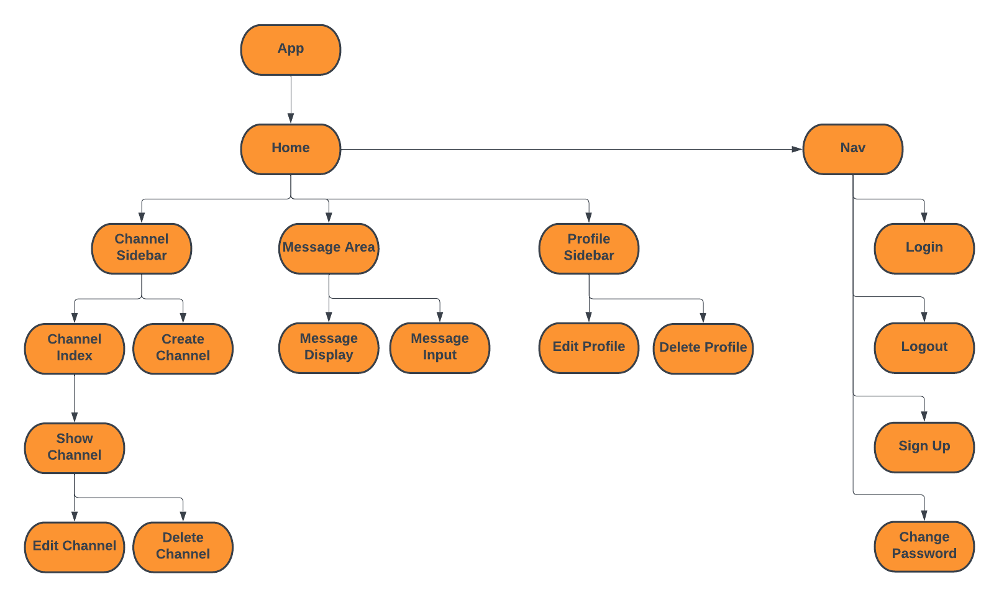

# Slack Clone

## Overview

Slack clone app where users can create and join different channels and chat with other users. Built with the MERN stack (Mongoose, Express, React, Node.js) using the MVC system for organizing the code.

## User Stories
```
- As an unregisterd user, I would like to sign up with email & password.
- As a registered user, I would like to sign in with email & password.
- As a signed in user, I would like to change password.
- As a signed in user, I would like to sign out.
- As a signed in user, I would like to send a chat message (socket).
- As a signed in user, I would like to create my own channels.
- As a signed in user and authorized owner of a channel, I would like to edit and update channel details.
- As a signed in user and authorized owner of a channel, I would like to delete my own channels.
- As a signed in user in a channel, I would like to see the messages in a chat (socket).
- As a signed in user, I would like to create my own profile.
- As a signed in user, I would like to update my own profile.
- As a signed in user, I would like to delete my profile.
```

## Technologies
    - HTML
    - CSS
    - JavaScript
    - React
    - Mongoose
    - MongoDB
    - Express
    - Node.js
    - Socket.io (library that enables low-latency, bidirectional, and event-based communication between a client and a server -- for chat functionality)

## ERD
.png)

## Models
```js 
const userSchema = new mongoose.Schema({
    username: {
        type: String,
        required: true
    },
    email: {
        type: String,
        required: true
    },
    password: {
        type: String, 
        required: true
    }, 
    channels: [{
        type: mongoose.Schema.Types.ObjectId,
        ref: 'Channel'
    }],
    messages: [messageSchema],
    pronouns: { type: String },
    location: { type: String }
}, {
    toObject: {
        transform: (_doc, user) => {
            delete user.password
            return user
        }
    }
})

const channelSchema = new mongoose.Schema({
    name: {
        type: String,
        required: true
    },
    description: {
        type: String
    },
    members: [{
        type: mongoose.Schema.Types.ObjectId,
        ref: 'User'
    }],
    owner: {
        type: mongoose.Schema.Types.ObjectId,
        ref: 'User'
    },
    messages: [messageSchema]
})

const messageSchema = new mongoose.Schema({
    author: {
        type: mongoose.Schema.Types.ObjectId,
        ref: 'User',
        required: true
    },
    content: {
        type: String,
        required: true
    }
}, {
    timestamps: true
})
```

## Route Tables

### Authentication: Users

| **URL**              | **HTTP Verb** |**Actions**|
|----------------------|---------------|-----------|
| /auth/signup         | POST          | new       | 
| /auth/login          | POST          | create    | 
| /auth/logout         | DELETE        | destroy   |      
| /auth/:id            | GET           | show      |        
| /auth/:id            | PATCH         | update    |        

### Channels

| **URL**             | **HTTP Verb** |**Actions**|
|---------------------|---------------|-----------|
| /channels              | GET           | index
| /channels/:id          | GET           | show
| /channels/             | POST          | create
| /channels/:id          | PATCH         | update      
| /channels/:id          | DELETE        | destroy     

### Messages

| **URL**               | **HTTP Verb** |**Actions**|
|-----------------------|---------------|-----------|
| /messages/            | GET           | index
| /messages/:channelId  | POST          | create
| /messages/:channelId/ | PATCH         | update  
| /messages/:channelId/ | DELETE        | destroy  

## Wireframes

### Home


### Auth


### Profile


## Component Diagram



## Stretch Goals
    - upload for user profile photos
    - message text formatting
    - message photo uploading
    - ability for user to search through messages
    - direct messaging between users (can this be done using the channels model? set channel name as the two users' usernames and )